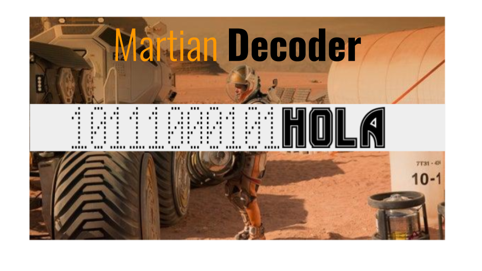
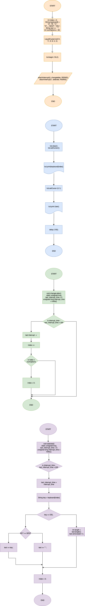
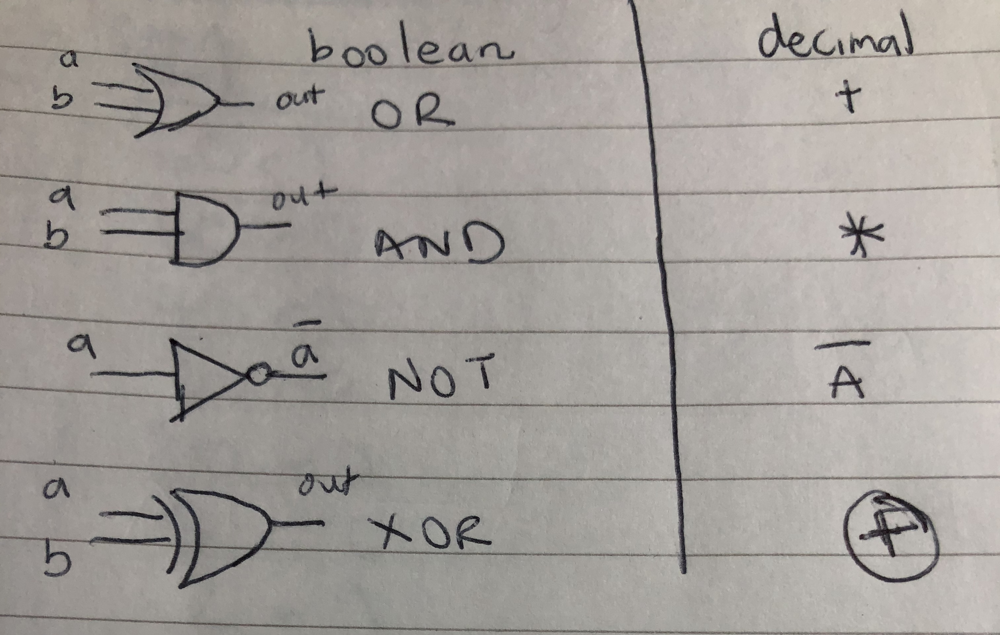
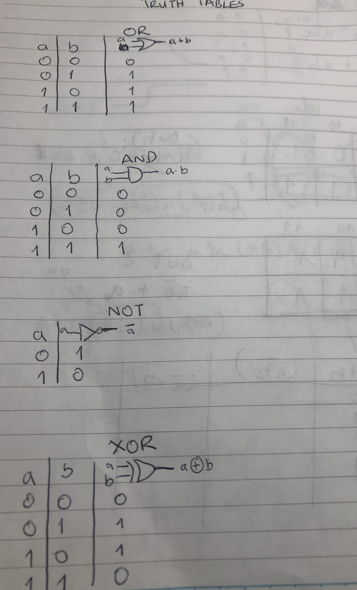

# The Martian Decoder


## Planning

### Definition of the problem
This definitely came as a surprise. A war against aliens on Mars. After two scares of a potential World War 3, it was never a concern for people that we would start fighting against other planets. It is the first inter-planetry war and it will be called the Stars Wars(just like the well-known movie). Aware of the extraordinary abilities of the Martians and in desperation not to lose, NASA has demanded drafting about a quarter of the world's population to fight the war. Many families of the selected people are reluctant to send off their relatives since this war is beyond our planet. They only way they can be comfortable with this decision is if a two-way commuincation can be established between them and their relative(s). This means  creating a stable means of communication between the Earth and Mars.  NASA has already set up many communication stations around the world and has said that it will set up its portable station immediately they arrive on Mars. Unfortunately, The station in Earth can only communicate using Morse Code and the station on Mars can only communicate in Binary Code. Humans are not conversant with these languages. The identified clients for this project are the people on Earth who would like to keep communicating with one or more of their relatives in the war and also those in the war. We are talikng about the whole Earth basically.

### Proposed solution
We are going to create a device that ensures stable communication between the people on Earth and on Mars. It will be called "the Martian Decoder". 
I am going to make use of the arduino c to develop this Martian decoder. 


### Success criteria
It must be able to communicate with people easily across planets.

## Solution Overview

### Design

**Fig. 6** This figure shows the initial plans for developing the the two push buttons keyboard.

### Success criteria for making this keyboard.
① The functionality of the keyboard should be DISCOVERABLE by the user.

① The keyboard should provide FEEDBACK to the user.

① The system must be EFFICIENT(allows the user to type words per min)

The whole idea of this 2 push button keyboard is to be able to communicate by using only two keys.

### Key Functionality
The left key has the letter "A" and the left arrow below it. This shows that this key only inputs alphabets.

The right key has the number "1" and the right arrow below it. This key only inputs numbers and the space bar.

### Mechanism
Pushing the left button indicates that one is entering an alphabet and pushing the right button indicates a number. When either button is pressed, the button lose their functionality and become arrow keys. The arrow keys are used to navigate to a desired character. When a character is left unmoved for more than a second, the system prints out the character. After the character is printed, the right and left buttons return to being an alpha and a numeric key respectively.
The reference point for the alpha key is "A". Pushing the left arrow moves through the alphabets in a reverse order( A to Z,Y,X...) while pushing the right arrow moves through the alphabets the conventional way( A to B,C,D...).

### Flowchart for the English Input System


**Fig. 7** The flowchart shows the process of developing the English Input System.

Development
-----------
## A traffic light with arduino 
A traffic light with arduino is a good way to be introduced into how to use the arduino.
```.c
void setup()
{
  pinMode(13, OUTPUT);
  pinMode(12, OUTPUT);
  pinMode(11, OUTPUT);
}

void loop()
{
  digitalWrite(13, HIGH);
  delay(1000); // Wait for 1000 millisecond(s)
  digitalWrite(13, LOW);
  delay(1000); // Wait for 1000 millisecond(s)
  digitalWrite(12, HIGH);
  delay(1000); // Wait for 500 millisecond(s)
  digitalWrite(12, LOW);
  delay(1000); // Wait for 500 millisecond(s)
  digitalWrite(11, HIGH);
  delay(1000); // Wait for 1000 millisecond(s)
  digitalWrite(11, LOW);
  delay(1000); // Wait for 1000 millisecond(s)
}
```
"pinMode" function is used to decide whether a pin is an input or output.

"digitalWrite" function is used to set a high(on) or low(off) value to a pin. 

### STOP!, GET READY!, GOOOOOOO!!
These are the three phases of the traffic light.


**Fig. 1** This diagram shows the red light on indicating STOP.


**Fig. 2** This diagram shows the amber light on indicating GET READY.


**Fig. 3** This diagram shows the green light on indicating GO.

NOW LETSSSSSS GOOOOOO!!! VROOM VROOM!!

### Data Types in Arduino
| Data Type     | Range                          | Use or Description                                                 |
|---------------|--------------------------------|--------------------------------------------------------------------|
| Boolean       | 0 or 1                         | Simple true or false statements                                    |
| Long          | -2,147,483,648 - 2,147,483,648 | Negative integers, positive integers or 0. Eg. Population of Japan |
| Word          | 0 - 65535                      | Positive integers and 0.                                           |
| Char          | -128 - 127                     | English letters, numbers and some special characters.              |
| Float         | -3,4028235e38 - 3,4028235e38   | Decimals and scientific notation. Eg. The numerical value of pi.   |
| Int           | -32,768 - 32,767               | Negative, positive integers, and 0.                                |
| Unsigned Char | 0 - 255                        | Positive integers and 0. Eg. Height of man                         |
| Unsigned Long | 0 - 4,294,967,295              | Positive integers and 0.                                           |
| Void          | ------                         | It is a function that returns no values                            |
| Unsigned Int  | 0 - 65535                      | Positive integers and 0.                                           |

### Conversion of base 10 to base 2
This was very important to understand in the creation of our next program.

**Fig. 3** This diagram shows how to convert numbers from base 10 to base 2.
### Conversion of base 10 to other bases
1. Get the number.
1. Divide the number continuously by the new base until you get zero.
1. For each time you divide by the new base record the remainder.
1. Write the remainders in reverse form.
1. This gives you the new number in the new base.
### Conversion of base 2 to base 10.
1. Write down the binary number.
1. Write down the position of the individual numbers (1’s and 0’s) starting from the furthermost right. The first digit should have a position zero.
1. Express the positions in terms of powers of two. (eg. 8^0 for position zero)
1. Multiply the individual numbers by the powers of two
1. Add the products.
### Conversion of other bases to base 10. 
1. Write down the number.
1. Write down the position of the individual numbers starting from the furthermost right. The first digit should have a position zero.
1. Express the positions in terms of powers of the base. (eg. 8^0 for position zero)
1. Multiply the individual numbers by the powers of the base.
1. Add the products.

### The Hexadecimal base.
In the decimal base, we have digits only from 0 to the number before 10 (0-9). That is the same for every other base. But for the hexademical base, the numbers (10-15) aren't expressed as single digits. Hence, we express them as digits. A-10, B-11, C-12, D-13, E-14 and F-15. 

### Creating a counter from 0 to 31 in binary using LED lights.
| bitA | bitB | bitC | bitD | bitE | Number |   |   |   |
|------|------|------|------|------|--------|---|---|---|
| 0    | 0    | 0    | 0    | 0    | 0      |   |   |   |
| 0    | 0    | 0    | 0    | 1    | 1      |   |   |   |
| 0    | 0    | 0    | 1    | 0    | 2      |   |   |   |
| 0    | 0    | 0    | 1    | 1    | 3      |   |   |   |
| 0    | 0    | 1    | 0    | 0    | 4      |   |   |   |
| 0    | 0    | 1    | 0    | 1    | 5      |   |   |   |
| 0    | 0    | 1    | 1    | 0    | 6      |   |   |   |
| 0    | 0    | 1    | 1    | 1    | 7      |   |   |   |
| 0    | 1    | 0    | 0    | 0    | 8      |   |   |   |
| 0    | 1    | 0    | 0    | 1    | 9      |   |   |   |
| 0    | 1    | 0    | 1    | 0    | 10     |   |   |   |
| 0    | 1    | 0    | 1    | 1    | 11     |   |   |   |
| 0    | 1    | 1    | 0    | 0    | 12     |   |   |   |
| 0    | 1    | 1    | 0    | 1    | 13     |   |   |   |
| 0    | 1    | 1    | 1    | 0    | 14     |   |   |   |
| 0    | 1    | 1    | 1    | 1    | 15     |   |   |   |
| 1    | 0    | 0    | 0    | 0    | 16     |   |   |   |
| 1    | 0    | 0    | 0    | 1    | 17     |   |   |   |
| 1    | 0    | 0    | 1    | 0    | 18     |   |   |   |
| 1    | 0    | 0    | 1    | 1    | 19     |   |   |   |
| 1    | 0    | 1    | 0    | 0    | 20     |   |   |   |
| 1    | 0    | 1    | 0    | 1    | 21     |   |   |   |
| 1    | 0    | 1    | 1    | 0    | 22     |   |   |   |
| 1    | 0    | 1    | 1    | 1    | 23     |   |   |   |
| 1    | 1    | 0    | 0    | 0    | 24     |   |   |   |
| 1    | 1    | 0    | 0    | 1    | 25     |   |   |   |
| 1    | 1    | 0    | 1    | 0    | 26     |   |   |   |
| 1    | 1    | 0    | 1    | 1    | 27     |   |   |   |
| 1    | 1    | 1    | 0    | 0    | 28     |   |   |   |
| 1    | 1    | 1    | 0    | 1    | 29     |   |   |   |
| 1    | 1    | 1    | 1    | 0    | 30     |   |   |   |
| 1    | 1    | 1    | 1    | 1    | 31     |   |   |   |

```.c

  for (int n = 0; n <= 31; n++) {
  	//bit E
    if (n % 2 == 1) {
    	digitalWrite(bitE, HIGH);
  	}else
    {
      digitalWrite(bitE, LOW);
    }
    //bit D 
    if (n % 4 > 1) {
      digitalWrite(bitD, HIGH);
     }else
    {
      digitalWrite(bitD, LOW);
    }
     //bit C
    if (n % 8 > 3) {
      digitalWrite(bitC, HIGH);
    }else
    {
      digitalWrite(bitC, LOW);
    }
     //bit B
    if (n % 16 > 7) {
      digitalWrite(bitB, HIGH);
    }else
    {
      digitalWrite(bitB, LOW);
    }
     //bit A
    if (n % 32 > 15) {
      digitalWrite(bitA, HIGH);
    }else
    {
      digitalWrite(bitA, LOW);
    }
    delay(2000);
  }
}
```
The important part of this code is the use of modulo operation(%) to determine when the LEDs come on and off.

### Counting in different bases
Different bases have different numbers but similar patterns. 

| decimal | binary | base three | base five | base eight |
|---------|--------|------------|-----------|------------|
| 0       | 0      | 0          | 0         | 0          |
| 1       | 1      | 1          | 1         | 1          |
| 2       | 10     | 2          | 2         | 2          |
| 3       | 11     | 10         | 3         | 3          |
| 4       | 100    | 11         | 4         | 4          |
| 5       | 101    | 12         | 10        | 5          |
| 6       | 110    | 20         | 11        | 6          |
| 7       | 111    | 21         | 12        | 7          |
| 8       | 1000   | 22         | 13        | 10         |
| 9       | 1001   | 100        | 14        | 11         |
| 10      | 1010   | 101        | 20        | 12         |

### Boolean Operators

**Fig. 4** This figure shows the fundamental Boolean operators and their equivalents in basic arithmetic operations. 

### Logic Gates
### Truth Tables

**Fig. 5** This figure shows the truth tables for the basic Boolean operators.

OR: In the OR gate, the output is true only if either of the inputs are true.

AND: In the AND gate, the output is true only if both or all of the inputs are true.

NOT: NOT reverses or inverts the input.

EXCLUSIVE OR (XOR): In this gate, the output if true only when one of the inputs is true at a time.

### Interpreting questions on Boolean operators using the logic gates.

### What is Usability?
Usability according to IB CompSci Hub is the ease of use and learnability of a human made object [1]. 

### Human Centered Design(HCD)
Principle of Design[2]
1. Discoverability
2. Feedback

### Morse Code
As mentioned earlier in the definition of the problem, the station in Earth can only communicate using Morse Code. Hence it is important we know what the Morse Code is all about. According to Wikipedia, Morse Code is a method used in telecommunication to excode text characters as standardized sequences of two different signal durations, called "dots" and "dashes". Morse Code is named after Samuel B.F Morse, an inventor of the telegraph[3].

### Chart of the Morse Code.[4]

| CHARACTER |      |      |      |      |      |
|--------|------|------|------|------|------|
| A      | DOT  | DASH |      |      |      |
| B      | DASH | DOT  | DOT  | DOT  |      |
| C      | DASH | DOT  | DASH | DOT  |      |
| D      | DASH | DOT  | DOT  |      |      |
| E      | DOT  |      |      |      |      |
| F      | DOT  | DOT  | DASH | DOT  |      |
| G      | DASH | DASH | DOT  |      |      |
| H      | DOT  | DOT  | DOT  | DOT  |      |
| I      | DOT  | DOT  |      |      |      |
| J      | DOT  | DASH | DASH | DASH |      |
| K      | DASH | DOT  | DASH |      |      |
| L      | DOT  | DASH | DOT  | DOT  |      |
| M      | DASH | DASH |      |      |      |
| N      | DASH | DOT  |      |      |      |
| O      | DASH | DASH | DASH |      |      |
| P      | DOT  | DASH | DASH | DOT  |      |
| Q      | DASH | DASH | DOT  | DASH |      |
| R      | DOT  | DASH | DOT  |      |      |
| S      | DOT  | DOT  | DOT  |      |      |
| T      | DASH |      |      |      |      |
| U      | DOT  | DOT  | DASH |      |      |
| V      | DOT  | DOT  | DOT  | DASH |      |
| W      | DOT  | DASH | DASH |      |      |
| X      | DASH | DOT  | DOT  | DASH |      |
| Y      | DASH | DOT  | DASH | DASH |      |
| Z      | DASH | DASH | DOT  | DOT  |      |
| 0      | DASH | DASH | DASH | DASH | DASH |
| 1      | DOT  | DASH | DASH | DASH | DASH |
| 2      | DOT  | DOT  | DASH | DASH | DASH |
| 3      | DOT  | DOT  | DOT  | DASH | DASH |
| 4      | DOT  | DOT  | DOT  | DOT  | DASH |
| 5      | DOT  | DOT  | DOT  | DOT  | DOT  |
| 6      | DASH | DOT  | DOT  | DOT  | DOT  |
| 7      | DASH | DASH | DOT  | DOT  | DOT  |
| 8      | DASH | DASH | DASH | DOT  | DOT  |
| 9      | DASH | DASH | DASH | DASH | DOT  | 

1. The length of a dot is one second(unit).
2. A dash is three seconds(units).
3. The space between parts of the same letter is one second(unit).
4. The space between letters three seconds(units).
5. The space between letters seven seconds(units).


## Evaluation

## References
[1] Retrieved from https://ib.compscihub.net/wp-content/uploads/2018/06/1.2.12.pdf on 25th November 2019.

[2] Retrieved from https://www.youtube.com/watch?v=yY96hTb8WgI on 25th November 2019.

[3] Retrieved from https://en.wikipedia.org/wiki/Morse_code on 23rd January 2020.

[4] Retrieved from https://en.wikipedia.org/wiki/Morse_code#/media/File:International_Morse_Code.svg on 23rd January 2020.


